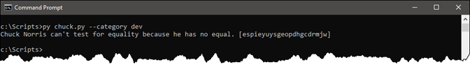
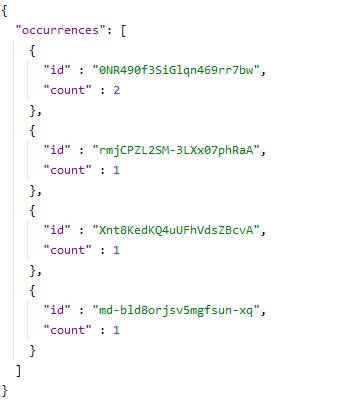

*420-3A5-EM Automatisation de tâches (H2021)*
# Travail pratique #3 <!-- omit in toc --> 

Ce TP est à faire individuellement. Il compte pour 15% de la note du cours.

## Table des matières <!-- omit in toc --> 
- [1. Préparation](#1-préparation)
- [2. Blague Spécifique](#2-blague-spécifique)
- [3. Filtrage par catégorie](#3-filtrage-par-catégorie)
- [4. Liste des catégories](#4-liste-des-catégories)
- [5. Recherche de blague](#5-recherche-de-blague)
- [6. Rubrique d'aide](#6-rubrique-daide)
- [7. Gestion des erreurs](#7-gestion-des-erreurs)
- [8. Compteur de blagues](#8-compteur-de-blagues)

## Mandat <!-- omit in toc --> 

Votre patron vous demande de développer un script Python permettant de raconter de bonnes vieilles blagues de Chuck Norris.

Vous devez utiliser l’API ChuckNorris.io (https://api.chucknorris.io/) pour générer les blagues. Cette API prend des requêtes GET et retourne du contenu JSON.

### 1. Préparation

Lorsque le script est exécuté sans aucun paramètre, il affiche une blague au hasard. Le numéro d’identification unique de cette blague doit être écrit entre crochets à la fin de la blague, pour référence.

### 2. Blague Spécifique

Lorsqu’on passe le numéro d’identification d’une blague, la blague correspondante est affichée.

### 3. Filtrage par catégorie

Si on spécifie le paramètre `--category` (ou `-c`), suivi du nom d’une catégorie valide, une blague au hasard est affichée, mais seulement dans cette catégorie. Cela limite les choix possibles.

### 4. Liste des catégories

On peut obtenir la liste des catégories valides en spécifiant `--list-category` ou `-l`.

### 5. Recherche de blague

On peut rechercher un mot-clé spécifique dans la base de données de blagues. En passant ce mot-clé par le paramètre `--search` ou `-s`, on obtient la liste des blagues contenant ce mot-clé. On doit aussi voir le nombre de résultats.

### 6. Rubrique d'aide

Ce script doit prendre des arguments à la ligne de commandes. Il est donc normal que celui-ci soit pourvu d’une rubrique d’aide, accessible à l’aide de `-h` ou `--help`.

### 7. Gestion des erreurs

Lorsque la ressource demandée n’existe pas (identifiant de blague ou nom de catégorie invalide), le code de l’erreur http est affiché à l’écran. Il sert également de code de retour.

Parlant du code de retour, lorsque le script est lancé avec succès, le code de retour doit être `0`.

### 8. Compteur de blagues

Finalement, chaque fois qu’une blague est affichée à l’écran, le script doit garder en mémoire le nombre de fois que cette blague précise a été affichée. Il doit le faire sur un fichier Chuck.json situé dans le répertoire de travail.

Lorsque le fichier n’existe pas, il doit être créé. Il est constitué d’un objet JSON dont l’unique clé, `occurrences`, est un tableau d’objets constitués à leur tour d’un identifiant (`id`) et du compte d’occurrences (`count`). Chaque fois qu’une blague sort, si cette blague figure dans le fichier, le compteur doit être incrémenté. Sinon, une nouvelle entrée doit être créée pour cette blague, avec le compte de 1.

Le fichier doit être structuré comme ceci :

---

## BON TRAVAIL! <!-- omit in toc --> 

